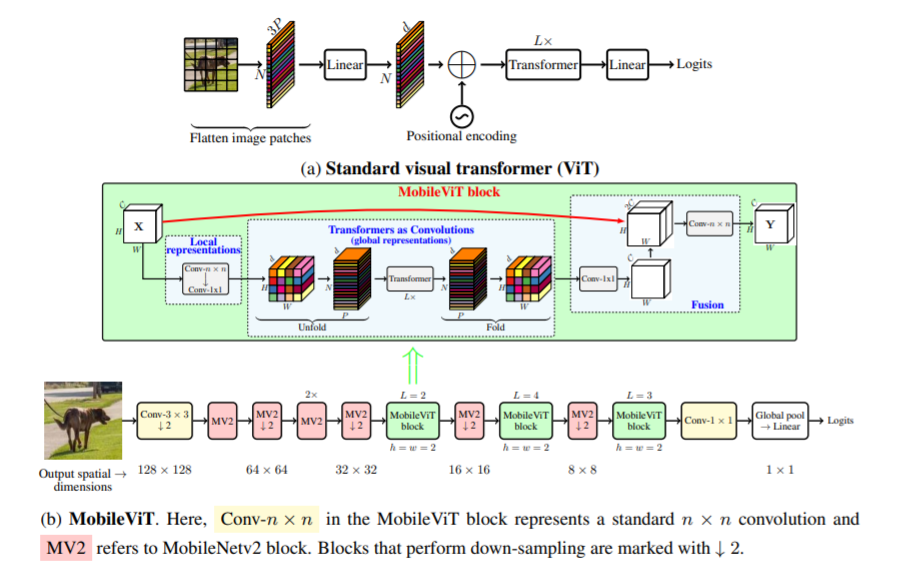

# MobileViT: Light-weight, General-purpose, and Mobile-friendly Vision Transformer (2021)

## Overview
PyTorch Lightning implementation of MobileVit ([MobileViT: Light-weight, General-purpose, and Mobile-friendly Vision Transformer](https://arxiv.org/abs/2110.02178), 2021).

## Credits
Code adapted from [MobileViT](https://github.com/chinhsuanwu/mobilevit-pytorch).
